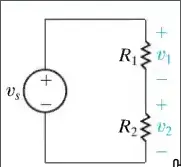
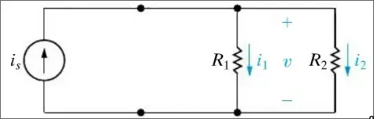
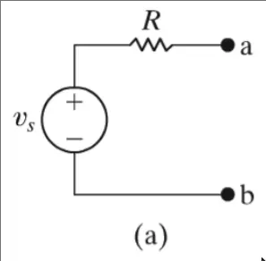
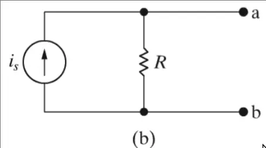
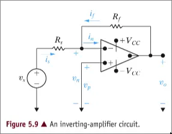
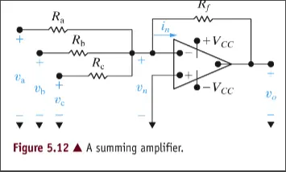
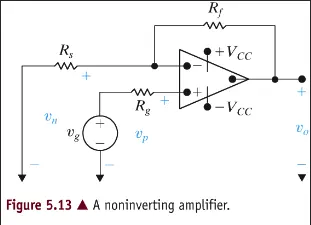
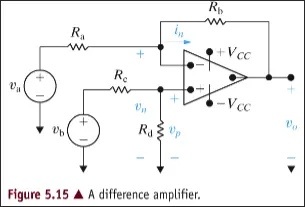

> [!TLDR] Effekt
>
> $$p=\frac{dw}{dt}$$
>
> $$p=vi$$

> [!TLDR] Ohm's Lag
>
> $$v=iR$$
>
> $$p=i^2R$$
>
> $$p=\frac{v^2}{R}$$

> [!TLDR] Kirchhoff's Lagar
> 
> **Ström (KCL):**
> Summan av strömmar till (eller från) en nod är noll
> 
> $$\sum_{j}i_j = 0$$
>
> **Spänning (KVL):**
> Summan av spänningar i en slinga är noll
>
> $$\sum_{k}v_k = 0$$

> [!TLDR] Seriekopplade motstånd
>
> $$R_{eq}=\sum_{i=1}^{k}R_i$$
>
> $$v_s=i_sR_{eq}=i_s\sum_{i=1}^{k}R_i$$
>

> [!TLDR] Parallellkopplade motstånd
> 
> $$KCL \Rightarrow i_s = \sum_{j=1}^{k} i_j $$
>
> $$\frac{i_s}{v_s}=\frac{1}{R_{eq}}=\sum_{i=1}^{k}\frac{1}{R_i}$$
> 
> För två resistanser:
> $$R_{eq}=R_1||R_2=\frac{R_1 R_2}{R_1 + R_2}$$
>

> [!TLDR] KCL ger:
> 
> $$i=\frac{v_s}{R_1 + R_2}$$
> För:
> 
> [!TLDR] Ohm's lag ger då
>
> $$v_1=iR_1=v_s\frac{R_1}{R_1+R_2}$$
>
> $$v_2=iR_2=v_s\frac{R_2}{R_1+R_2}$$
>

> [!TLDR] Ohm's lag ger
>
> $$v=i_1R_1=i_2R_2=\frac{R_1R_2}{R_1+R_2}i_s$$
> För:
> 
> 
> Vilket medför:
>
> $$i_1=i_s\frac{R_2}{R_1+R_2}$$
>
> $$i_2=i_s\frac{R_1}{R_1+R_2}$$
>

> [!TLDR] Motsvarande kretsar
>  
>
> Resistiv last kopplas mellan nod $a$ & $b$
>
> för (a) gäller: $$i_L = \frac{v_s}{R+R_L}$$
>
> för (b) gäller: $$i_L = \frac{R}{R+R_L}i_s$$
>
> Strömmen genom lasten är identisk om:
> $$i_s=\frac{v_s}{R}$$
>
> Vilket då innebär att kretsarna kan ersätta varandra
>

> [!TLDR] Thévenin-ekvivalent krets
>
> Krets kan modeleras som en spänningskälla och ett motstånd i serie
>
> $$i_{sc}=\frac{V_{Th}}{R_{Th}}$$
> $$R_{Th}=\frac{V_{Th}}{i_{sc}}$$
>

> [!TLDR] Steg för Steg
>
> - Bestäm obelastad spänning -> $V_{Th}$
> - Bestäm kortslutningsström -> $R_{Th}$

> [!TLDR] Norton-ekvivalent krets
> 
> Fås genom källtransformation av Thévenin-krets
>
> $$i_s=\frac{v_s}{R}$$
>

> [!TLDR] OpAmp basics
> 
> $$A=\begin{cases}{l}-V_{CC} & A(v_p - v_n) < -V_{CC},\\ A(v_p - v_n) & -V_{CC} \leq A(v_p -v_n) \leq +V_{CC}, \\ +V_{CC} & A(v_p - v_n) > +V_{CC}. \end{cases}$$
>
> $$v_p = v_n$$
>
> $$i_p = i_n = 0$$
>

> [!TLDR] Inverterande OpAmp
>
> 
>
> $$v_o = \frac{-R_f}{R_s}v_s$$ (5.10)
>

> [!TLDR] Summerande OpAmp
>
> 
>
> $$v_o=-(\frac{R_f}{R_a}v_a + \frac{R_f}{R_b}v_b + \frac{R_f}{R_c}v_c)$$ (5.14)
>

> [!TLDR] Icke-Inverterande OpAmp
>
> 
> 
> $$v_o = \frac{R_s + R_f}{R_s}v_g$$ (5.18)
>

> [!TLDR] Differens OpAmp
>
> 
>
> $$v_o = \frac{R_b}{R_a}(v_b - v_a)$$ (5.24)
>

> [!TLDR] Spole
>
> $$v=L\frac{di}{dt}$$
>
> $$i(t)=\frac{1}{L}\int^{t}_{t_0}vd\tau + i(t_0)$$
>
> $$p=vi=Li\frac{di}{dt}$$
>
> $$w=\frac{1}{2}Li^2$$
>
> motsvarar kortslutning vid konstant ström då $v=0$
>
> > [!INFO] Seriekoppling 
> >
> > $$L_{eq}=\sum_{i=k}^k L_i$$
> >
>
> > [!INFO] Parallellkoppling
> >
> > $$\frac{1}{C_{eq}}=\sum^k_{i=k}C_i$$
> >

> [!TLDR] Kondensator
> 
> $$i=C\frac{dv}{dt}$$
>
> $$v(t)=\frac{1}{C}\int^t_{t_0}id\tau + v(t_0)$$
>
> $$p=vi=Cv\frac{dv}{dt}$$
>
> $$w=\frac{1}{2}Cv^2$$
>
> motsvarar bruten krets vid konstant ström då $i=0$
>
> > [!INFO] Seriekoppling
> > 
> > $$\frac{1}{C_{eq}}=\sum^k_{i=k}\frac{1}{C_i}$$
> >
> 
> > [!INFO] Parallellkoppling
> >
> > $$C_{eq}=\sum^k_{i=k}C_i$$
> >

> [!TLDR] Naturliga svar för RL och RC
>
> $$x(t)=x_f+[x(t_0)-x_f]e^{-(t-t_0)/\tau}$$
> 
> där $x$ ersätts av ström eller spänning
>
> ex:
>
> $$i(t)=\frac{V_s}{R}+(I_o-\frac{V_s}{R})e^{-(R/L)t}$$
>

> [!TLDR] Euler's formel
> 
> $$e^{ix}=\cos{x}+i\sin{x}$$
>
> $$\cos{x}=\mathbb{R}(e^{ix})=\frac{e^{ix}+e^{-ix}}{2}$$
>
> $$\sin{x}=\mathbb{I}(e^{ix})=\frac{e^{ix}+e^{-ix}}{2i}$$
>

