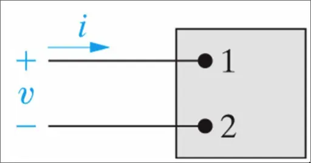

# Elkretsteori

## Teori
> [!INFO] 3 Antaganden
> - Elektriska effekter sker instant inom en krets
> - Nettoladdningen för komponenter är noll
> - Ingen magnetisk koppling mellan komponenterna
> 
> Annars gäller ElMag teori

### Grundläggande Formler
> [!TLDR] Ström
> $$i = \frac{dq}{dt}$$

> [!TLDR] Spänning
> $$v = \frac{dw}{dq}$$

> [!TLDR] Effekt
> $$p=\frac{dw}{dt}$$
> $$p=vi$$

### Grund kretselement

> [!TLDR] Grundelement
> 

#### Teckenkonvention

> [!TLDR] Ström och Spänning
> Positiva när de går från hög till låg potential
> *Pasiva Teknets Konvention*

> [!TLDR] Effekt
> Positiv när element tar emot energi
> ***Ex:*** *resistor värms upp och avger värmestrålning*
>
> Negativ när element levererar energi
> ***Ex:*** *batteri omvandlar kemisk energi till ström*

