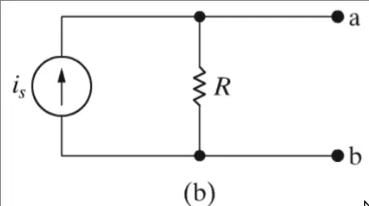

# Kretsanalys

## Källtransformationer

> [!TLDR] Motsvarande kretsar
>  
>
> Resistiv last kopplas mellan nod $a$ & $b$
>
> för (a) gäller: $$i_L = \frac{v_s}{R+R_L}$$
>
> för (b) gäller: $$i_L = \frac{R}{R+R_L}i_s$$
>
> Strömmen genom lasten är identisk om:
> $$i_s=\frac{v_s}{R}$$
>
> Vilket då innebär att kretsarna kan ersätta varandra
>

## Thévenin-ekvivalens

> [!TLDR] Thévenin-ekvivalent krets
>
> Krets kan modeleras som en spänningskälla och ett motstånd i serie
>
> $$i_{sc}=\frac{V_{Th}}{R_{Th}}$$
> $$R_{Th}=\frac{V_{Th}}{i_{sc}}$$
>

> [!TLDR] Steg för Steg
>
> - Bestäm obelastad spänning -> $V_{Th}$
> - Bestäm kortslutningsström -> $R_{Th}$

## Norton-ekvivalens

> [!TLDR] Norton-ekvivalent krets
> 
> Fås genom källtransformation av Thévenin-krets
>
> $$i_s=\frac{v_s}{R}$$
>
