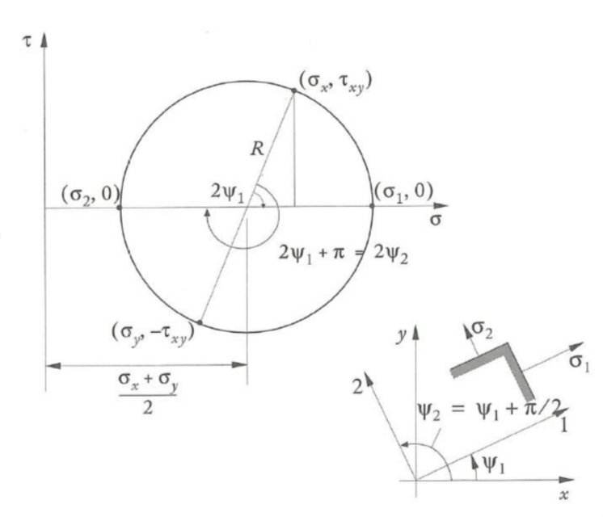
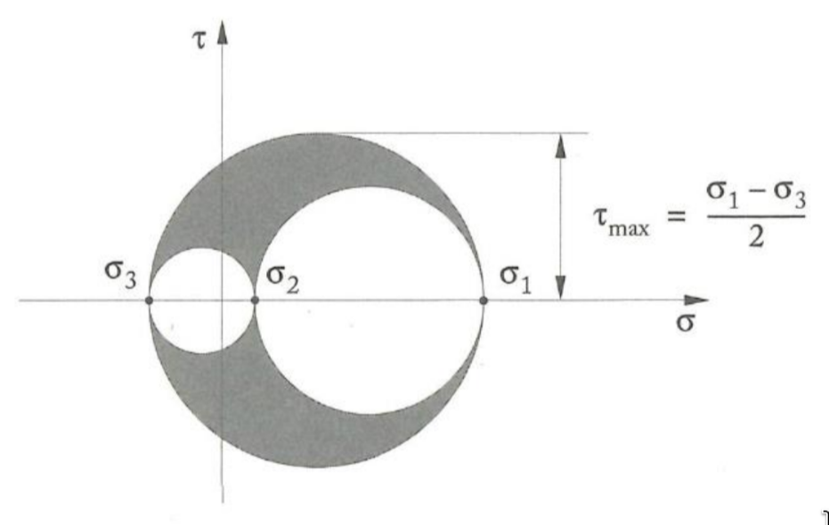

[Föreläsning 3 (PDF)](PDF/F3.pdf)

# Mohrs cirklar

> [!TLDR] Spänningscirkel
>
>  
> 
> $$\sigma_1=\sigma_{max}=\sigma_m+R$$
>
> $$\sigma_2=\sigma_{min}=\sigma_m-R$$
> 
> $$\tau_{xy}^{max}=R$$
>
> $$\sigma_m=\frac{\sigma_{xx}+\sigma_{yy}}{2}$$ (F.S. 1.11)
>
> $$R=\sqrt{\left(\frac{\sigma_{xx}-\sigma_{yy}}{2}\right)^2 +\tau_{xy}^2}$$
> 
> 
> Vinkeln mot huvudspänningsriktingen
> 
> $$\sin2\psi=\frac{\tau_{xy}}{R}$$
>

För varje punkt i en kropp kan tre Mohrs cirklar uppritas, gällande för plan vinkelrätt mot var och en av de tre huvudspänningsriktninarna.

