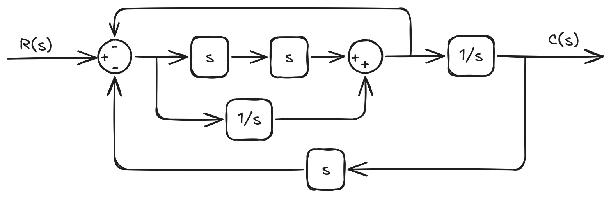
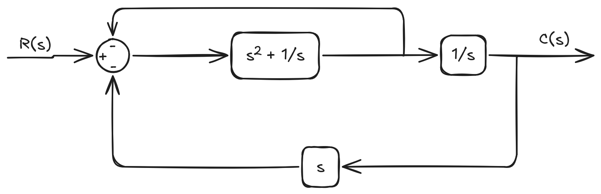
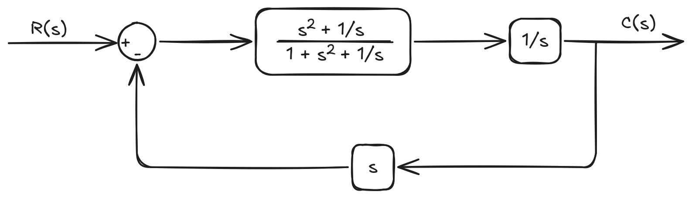
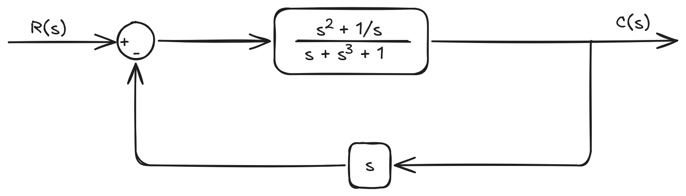
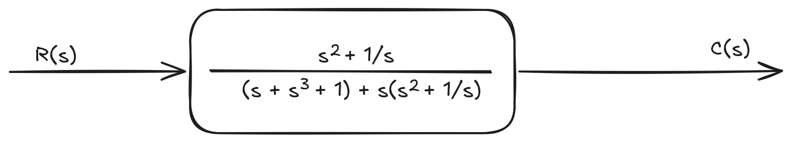
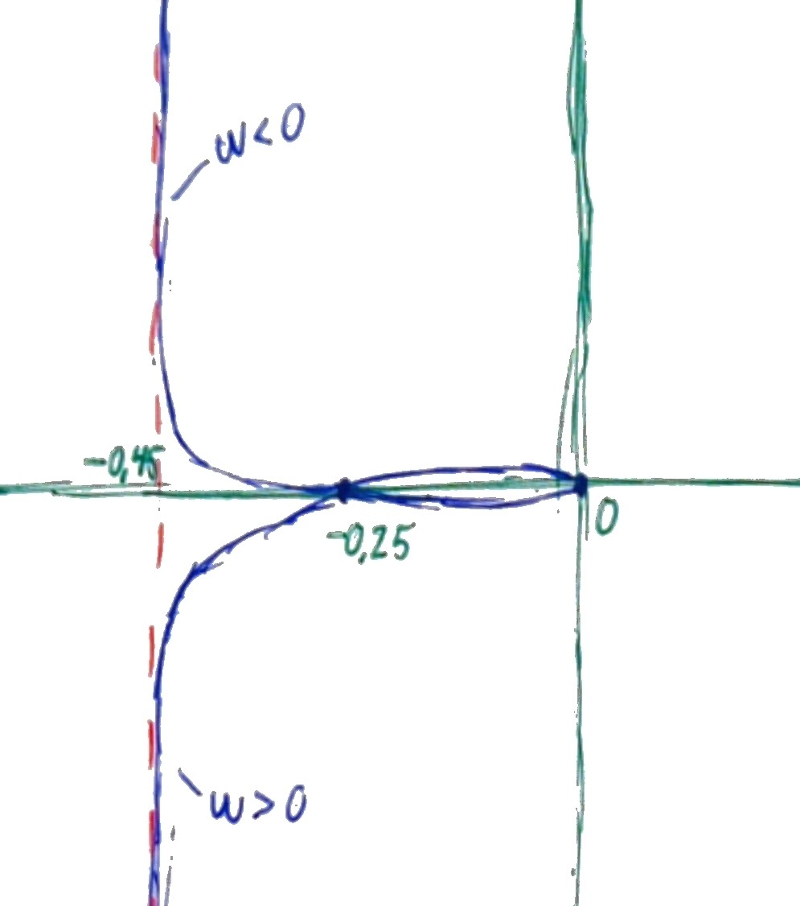
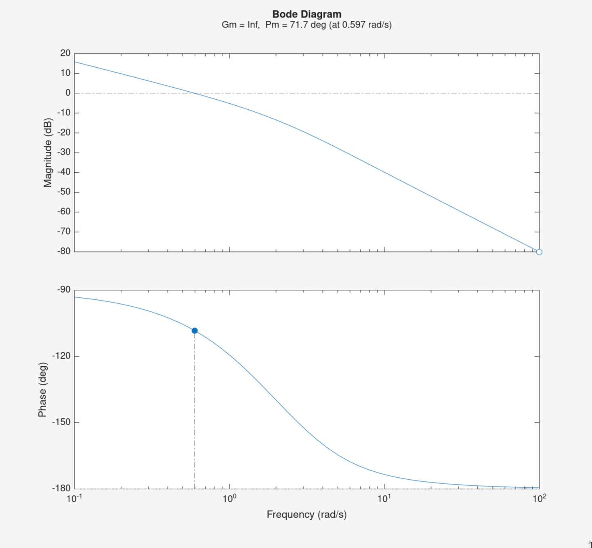

# 1. 

>  
> $$ \ddot{y} + 7\dot{y} + 10y = \dot{u} + 3u $$
> 

## a)

> 
> Zero at $t=0$
> 

Laplace transform:

$$ s^2Y(s) + 7sY(s) + 10Y(s) = sU(s) + 3U(s) $$
$$ \Rightarrow Y(s)( s^2 + 7s + 10 ) = U(s)( s + 3 ) $$

$$ \Rightarrow \frac{Y(s)}{U(s)} = \frac{ s + 3 }{ s^2 + 7s + 10 } $$

## b)

Unit step in laplace space is $U(s)=\frac{1}{s}$

$$ Y(s) = \frac{s+3}{ s^2 + 7s + 10 }\cdot\frac{1}{s} $$

Final value theorem:

$$ \lim_{t\to\infty}y(t)=\lim_{s\to 0}sY(s) $$

$$ sY(s) = \frac{s+3}{s^2+7s+10} $$

$$ \lim_{s\to 0} \frac{s+3}{s^2+7s+10}=\frac{3}{10} $$

> 
> $$ y(\infty)=0.3 $$
> 

## c)

$$ Y(s) = \frac{s+3}{s(s^2+7s+10)} = \frac{s+3}{s(s+2)(s+5)} $$

$$  = \frac{A}{s} + \frac{B}{s+2} + \frac{C}{s+5} $$

$$\Rightarrow s+3=A(s+2)(s+5)+Bs(s+5)+Cs(s+2)$$

$$
    \begin{cases}
        s=0: \;\;     3=A\cdot 2\cdot 5         & \Rightarrow  A=\frac{3}{10} \cr
        s=-2: \;   3-2 = B\cdot(-2)\cdot 3   & \Rightarrow  B=-\frac{1}{6} \cr
        s=-5:  \;  3-5 = C\cdot(-5)\cdot(-3) & \Rightarrow  C=-\frac{2}{15}
    \end{cases}
$$

$$
    \Rightarrow Y(s) = \frac{3/10}{s} - \frac{1/6}{s+2} - \frac{2/15}{s+5}
$$

$$ \Rightarrow \; y(t) = \frac{3}{10} - \frac{1}{6}e^{-2t} - \frac{2}{15}e^{-5t}, \;\; t\ge 0 $$

## d)

$$
    \lim_{t\to\infty}y(t) = \frac{3}{10} - \frac{1}{6}\cdot 0 - \frac{2}{15} \cdot 0 = \frac{3}{10}
$$

Matches with final value theorem

# 2.

## a)

Simplified:

$$ \frac{C(s)}{R(s)} = \frac{s^2+\frac{1}{s}}{2s^3+s+2} = \frac{s^3+1}{2s^4+s^2+2s} $$

## b)

Characteristic equation:

$$ 2s^4 + s^2 + 2s = 0 $$

$$ \Rightarrow s(2s^3 + s + 2) = 0 $$

Pole at $s=0$

Poles from $2s^3+s+2=0$:

Numeric solver on calculator gives root at $s\approx -0.84$

$$ \Rightarrow (s + 0.84)(2s^2-1.67s+2.39)=0 $$

solving for roots in $2s^2-1.67s+2.39=0$ gives:

$$ s\approx 0.42 \pm \sqrt{0.42^2-1.20} \approx 0.42 \pm 1.17j $$

Since the system roots have positive real parts the system is **Unstable**.

# 3.

Open-loop transfer function:

$$ G(s) = \frac{K(s+20)}{s(s+2)(s+3)} $$

Closed loop denominatior is $1+G(s)$ which gives the characteristic equation:

$$ 1+\frac{K(s+20)}{s(s+2)(s+3)}=0 $$

$$ \Rightarrow s(s+2)(s+3) + K(s+20) = s^3 + 5s^2 + (6+K)s + 20K  = 0 $$

For the system to be stable, all poles from the cubic must have negative real parts. We get negative real parts if all coefficients are $> 0$ 

$$
    \begin{cases}
        s^3: & 1 > 0 \cr
        s^2: & 5 > 0 \cr
        s^1: & 6 + K > 0 \cr
        s^0: & 20K > 0
    \end{cases}
$$

From that we get the lower limit $K> 0$.

Find where K becomes to big and crosses over in to the right half-plane ($s=j\omega$ crosses the imaginary axis)

$$ (j\omega)^3 + 5(j\omega)^2 + (6+K)(j\omega) + 20K = 0 $$

$$ \Rightarrow -j\omega^3 - 5\omega^2 + j(6+K)\omega + 20K = 0 $$

from the real part:

$$ -5\omega^2 + 20K = 0 \Rightarrow K=\frac{\omega^2}{4} $$

imaginary part:

$$ \omega(-\omega^2+6+K)=0 $$

for $\omega\ne 0$:

$$ -\omega^2+6+K=0 \Rightarrow \omega^2=6+K $$

$\omega^2$ in $K=\frac{\omega^2}{4}$ gives:

$$ K=\frac{6+K}{4} \Rightarrow 3K=6 \Rightarrow K=2 $$

which means the real part of the pole becomes positive, and the system becomes unstable, when $K> 2$

Answer: $0< K < 2$

# 4.

$$ \frac{h_1-h_2}{R_1}=q_1 $$

$$ C_1\frac{dh_1}{dt}=q-q_1 $$

$$ \frac{h_2}{R_2}=q_2 $$

$$ C_2\frac{dh_2}{dt}=q_1-q_2 $$

Laplace transform:

$$ Q_1(s)=\frac{H_1(s)-H_2(s)}{R} $$

$$ C_1sH_1(s) = Q(s)-Q_1(s) $$

$$ Q_2(s) = \frac{H_2(s)}{R_2} $$

$$ C_2sH_2(s) = Q_1(s)-Q_2(s) $$

$$ H_2(s) = Q_2(s)R_2 \;\; \Rightarrow \;\; C_2sQ_2(s)R_2=Q_1(s)-Q_2(s) $$

$$ \Rightarrow Q_1(s)=Q_2(s)[C_2R_2s+1] $$

From laplace-transformed $(1)$:

$$ H_1(s) = Q_1(s)R_1 + H_2(s) = Q_1(s)R_1 + Q_2(s)R_2 $$

$$ \Rightarrow C_1s[R_1Q_1(s) + R_2Q_2(s)] = Q(s) - Q_1(s) $$

$$ \Rightarrow Q(s) = Q_1(s)[C_1R_1s + 1] + Q_2(s)C_1sR_2 $$

subsitute in $Q_1(s)=Q_2(s)[C_2R_2s+1]$:

$$ Q(s) = Q_2(s)[(C_2R_2s+1)(C_1R_1s+1) + C_1R_2s] $$

$$ \Rightarrow \frac{Q_2(s)}{Q(s)} = \frac{1}{ R_1C_1R_2C_2s^2+(R_1C_1+R_2C_2+R_2C_1)s + 1 } $$

Q.E.D.

# 5.

$G(s)$ with $K=30$:

$$ G(s) = \frac{K}{s^3+6s^2+20s} $$

## a)

$s=j\omega$:

$$ G(j\omega) = \frac{K}{ (j\omega)^3 + 6(j\omega)^2 + 20j\omega } = \frac{K}{ -6\omega^2 + j\omega(20-\omega^2) } $$

$$ G(j\omega) = \frac{K( -6\omega^2 - j\omega(20-\omega^2) )}{ (-6\omega^2)^2 + (\omega(20-\omega^2))^2 } $$

Crosses the real axis when $\mathfrak{Im}[G(j\omega)]=0$

$$ \Rightarrow K\omega(20-\omega^2) = 0 $$

for $\omega \ne 0$:

$$ 20-omega^2 = 0 \; \Rightarrow \; \omega=\sqrt{20} $$

$$ \mathfrak{Re}[G(j\omega)] = \frac{K(-6\omega^2)}{ (-6\omega^2)^2 + (\omega(20-\omega^2))^2 } $$

at $\omega=\sqrt{20}$ we get $20-\omega^2=20-\left(\sqrt{20}\right)^2=0$

$$ \Rightarrow \mathfrak{Re}[G(j \sqrt{20})] = \frac{K\left(-6\left(\sqrt{20}\right)^2\right)}{\left(-6\left(\sqrt{20}\right)^2\right)^2}=-\frac{K}{6\left(\sqrt{20}\right)^2}=-\frac{K}{120}=-\frac{30}{120}=-0.25 $$

Crossing $G(j\omega)=-0.25$ at $\omega=\sqrt{20}\approx4.472\; \text{rad/s}$ $\Rightarrow \angle -90^\circ$

## b)

$$G(j\omega)= -\frac{180\omega^2}{36\omega^4+\omega^2(20-\omega^2)^2}-j\frac{30\omega(20-\omega^2)}{36\omega^4+\omega^2(20-\omega^2)^2}$$

$$\Rightarrow G(j\omega)=-\frac{180}{36\omega^2+(20-\omega^2)^2}-j\frac{30(20-\omega^2)}{36\omega^3+\omega(20-\omega^2)^2}$$

at $\omega\to\infty$ we get $G(j\infty) = 0$

at $\omega\to 0^+$ we get $G(j 0^+)=-\frac{180}{20^2}-j\infty=-0.45-j\infty$

at $\omega\to 0^-$ we get $G(j 0^-)=-0.45 + j\infty$

## c)

$Z=N+P$ where

- $Z$: Unstable poles of the closed loop system

- $N$: Encirclements of $(-1,j0)$

- $P$: Unstable poles of the open loop system

$P$:

$$s^3+6s^2+20s=0$$

$\Rightarrow$ pole at $s=0$

$$s^2+6s+20=0\Rightarrow s=-3\pm\sqrt{-11}$$

which means $P=0$.

For stable system no poles should lie in RHP wich means $N=0$.

$N$ becomes $1$ when the plot crosses the real axis to the left of $-1$.

From a) we have the crossing point:

$$G(j\omega)=-\frac{K}{120}$$

Since $G(j\omega)> -1$ we get $K<120$ we get $K<120$. The crossing point must also lay in the LHP which gives $K>0$.

Answer: $0<K<120$

# 6.

$$G(s)=\frac{K}{(s^2+13s+40)(s^2+2s+5)}$$

## a)

from $s^2+13s+40=0$:

$$s=\frac{-13}{2}\pm\sqrt{\left(\frac{13}{2}\right)^2-40}=-6.5\pm1.5$$

$$s_1=-5, \; s_2=-8$$

from $s^2+2s+5=0$:

$$ s = -1\pm\sqrt{1-5} = -1\pm j2 $$

$$s_3=-1+j2, \; s_4=-1-j2$$

Since $s_3$ and $s_4$ lie closer to the imaginary axis (real part closer to zero) they are the dominant poles.

## b)

When poles have real parts closer to zero their exponetial decay becomes slower, eg. $e^{-1t}$ vs $e^{-8t}$.
Therefore they determine the long term characteristics of the system more than poles that lie further from the imaginary axis.

# 7.

$$G(s)=\frac{K(s+5)}{s(s+2)(s+4)}$$

## a)

$$K=1\;\;\Rightarrow\;\; G(s)=\frac{s+5}{s(s+2)(s+4)}$$

in Bode form:

$$G(j\omega)=\frac{j\omega + 5}{j\omega(j\omega+2)(j\omega+4)}$$

normalised:

$$G(j\omega)=\frac{1+\frac{j\omega}{5}}{ j\omega( 1 + \frac{j\omega}{2} )( 1 + \frac{j\omega}{4} ) }$$

$$
    \begin{cases}
        [1]: (1+\frac{j\omega}{5})^1        & \text{First order term with real root} \cr
        [2]: (j\omega)^{-1}                 & \text{Root at origo} \cr
        [3]: (1+\frac{j\omega}{2})^{-1}     & \text{First order term with real root} \cr
        [4]: (1+\frac{j\omega}{4})^{-1}     & \text{First order term with real root}
    \end{cases}
$$

Break points ($1/\tau$):

$$
    \begin{cases}
        [1]: & \omega=5 \cr
        [2]: & - \cr
        [3]: & \omega=2 \cr
        [4]: & \omega=4
    \end{cases}
$$

Behaves like ($\omega$ above breakpoint) $[\text{dB}]$:

$$
    \begin{cases}
        [1]: & +20\log_{10}\omega \cr
        [2]: & -20\log_{10}\omega \cr
        [3]: & -20\log_{10}\omega \cr
        [4]: & -20\log_{10}\omega 
    \end{cases}
$$

Phase:

$$
    \begin{cases}
        [1]: & +90^\circ \cr
        [2]: & -90^\circ \cr
        [3]: & -90^\circ \cr
        [4]: & -90^\circ 
    \end{cases}
$$

## b)

From the plot we get a phase margin of around $60^\circ$ and no gain margin.

## c)

